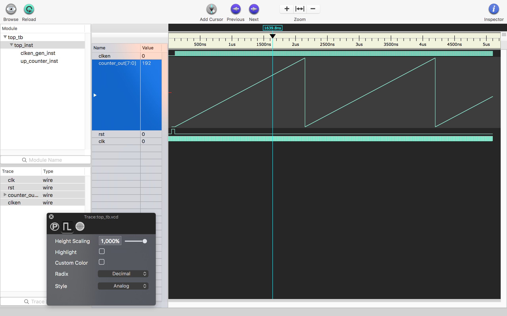

Verilog OS X
===

One can say VHDL is second class citizen in open source software / hardware world. For example, [IceStorm](http://www.clifford.at/icestorm) project only supports Verilog. Furthermore, easy to use and FOSS simulators like [Icarus Verilog](http://iverilog.icarus.com/) and [Verilator](http://www.veripool.org/wiki/verilator) also (in stable sense) only support Verilog.

Here you can find a bare-bones, OSX based Verilog simulation toolchain that I created using several different tools. Everything should be working under Linux as well (expect [Scansion](http://www.logicpoet.com/scansion)) though I haven't tested yet.

## Description

There are four different Verilog source files:

* `up_counter.v`: 8bit unsigned up counter with clock, reset and enable inputs.
* `clken_gen.v`: Clock enable pulse generator module with clock and reset inputs. Division ratio is parameterised.
* `top.v`: Main top module that instantiates an `up_counter` and a `clken_gen` module.
* `top_tb.v`: Testbench module that instantiates the top module and feeds the necessary test signals to the module.

If you want to change the example structure, see the `Makefile` then:

* Change `SRCS` variable with new source file names ...
* Change `TESTBENCH` variable for another test bench file name ...

Also, if you want to change the resulting waveform file:

* Modify `$dumpfile("top_tb.vcd");` line in the testbench code.

## Commands

- Hit `make simulate` to simulate the codebase and run the testbench using Icarus Verilog.
	- Testbench's output stream (`$display`, `$monitor` functions' outputs and also any error/log messages) is directed to `$TESTBENCHNAME_log.txt` file to make later analysis more convenient.

- Hit `make lint` to trigger linting using Verilator.

- Hit `make scansion` to open up the Scansion application with recently created signal file. Only works under OSX.

- Hit `make gtkwave` to open up the GTKWave application with recently created signal file. Not suggested for OSX.

- Hit `make clean` to delete any generated files.

## Prerequisites

You can use [Homebrew](https://brew.sh/) (brew) to install prerequisites. To install Homebrew run:
```sh
/usr/bin/ruby -e "$(curl -fsSL https://raw.githubusercontent.com/Homebrew/install/master/install)"
```

### [Icarus Verilog](http://iverilog.icarus.com/)
- Run `brew install icarus-verilog` to install on OSX system.

### [Verilator](https://www.veripool.org/projects/verilator/wiki/Intro)
- Even though verilator itself also supports simulation, I'm only using it to 'lint' the codebase for any syntax / logical errors.
- Run `brew install verilator` to install on OSX system.

### [GTKWave](http://gtkwave.sourceforge.net/)
- This application can be used to investigate .vcd waveform files. It was not very stable under OSX, so I moved on to other tool. Under Linux, this probably runs better.
- Run `brew install homebrew/gui/gtkwave` to install on OSX system.

### [Scansion](http://www.logicpoet.com/scansion/)
- This application is used to investigate .vcd waveform files. It is OSX only. It works much better (more stable) than gtkwave under OSX.
- Visit <http://www.logicpoet.com/scansion/> webpage to download the application. Makefile assumes that you put the OSX executable under `/Applications/` folder. You can change it if you want.

### [Sublime Text](https://www.sublimetext.com/)
- Sublime Text doesn't support Verilog language as valid syntax extension. You should install <https://packagecontrol.io/packages/Verilog> package from package manager to have basic syntax coloring and couple of extra features for Verilog inside Sublime Text.
- You can, of course, use any other text editor as well. :)

## Tips for analog waveform inspection

Scansion and GTKWave support visualising ports as analog waveforms. This feature is **very useful** in signal processing applications. Below you can see an example screenshot from *Scansion*:



Hit `⌘ + 2` to open `Trace Inspector` menu and select the desired signal. First, change the `Style` to **Analog** then adjust `Height Scaling` parameter to some high value to have bigger headroom in the display.

## References

You should check these short but dense documents about Verilog:

* [Summary of Synthesisable Verilog 2001](https://www.cl.cam.ac.uk/teaching/0910/ECAD+Arch/files/verilogcheatsheet.pdf)
* [Verilog Tips, Pitfalls to Avoid](http://retroactive.be/verilog_tips.pdf)
